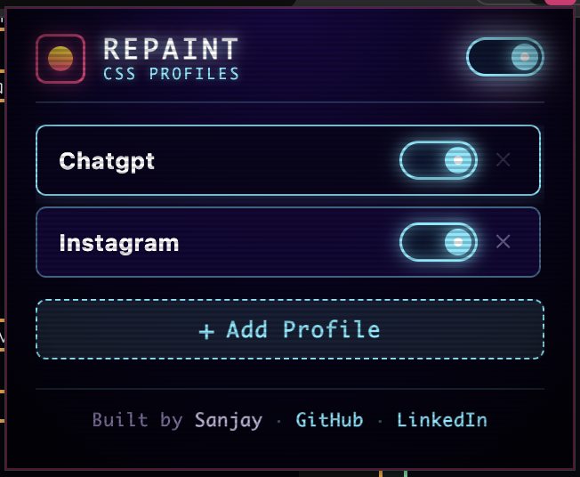
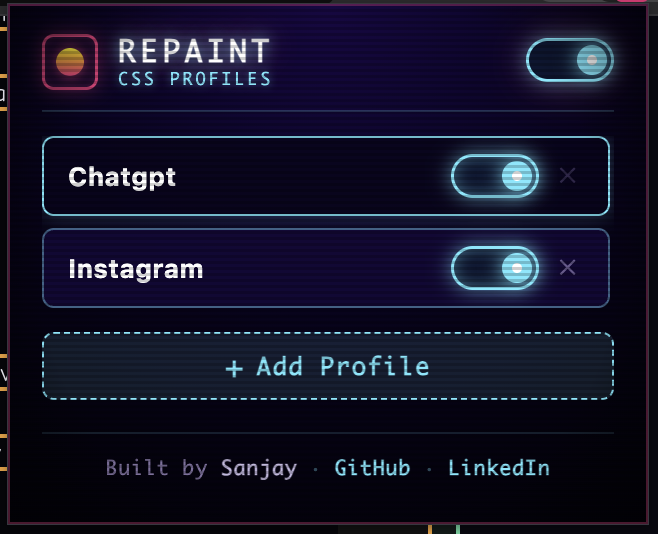

<div align="center">

# RePaint
### CSS Profiles for the Web

**Why accept the way a website looks when you can repaint it?**

*A universal browser extension engine that transforms any website with custom CSS profiles and instantaneous live injection.*

<br/>

[](manifest.json)
[](#installation)
[](#how-it-works)

</div>

---

## The Interface

<div align="center">
  
  &nbsp;&nbsp;&nbsp;&nbsp;
  
</div>

<br/>

## Why RePaint?

Every website has a design system chosen for you. **RePaint lets you choose your own.**

The modern web doesn't have to remain locked to default color schemes, rigid layouts, or eye-straining contrast. RePaint is built on a simple premise: **your browser belongs to you**. With RePaint, you have complete client-side authority over the visual presentation of every site you visit.

---

## How It Works

RePaint is designed as a universal, site-agnostic **CSS injection engine**. Rather than bundling hardcoded scripts for specific websites, it accepts standard `.css` stylesheets and handles domain targeting, persistence, and live runtime injection automatically.

```text
┌─────────────────┐       ┌──────────────────┐       ┌─────────────────┐       ┌─────────────────────┐
│   CSS Profile   │  ──▶  │  RePaint Engine  │  ──▶  │ Target Website  │  ──▶  │ Repainted Interface │
│ (.css stylesheet│       │ (MV3 Extension)  │       │ (DOM & Runtime) │       │ (Live Client-Side)  │
└─────────────────┘       └──────────────────┘       └─────────────────┘       └─────────────────────┘
```

1. **Upload**: Select any `.css` file from your disk.
2. **Bind**: RePaint automatically detects and binds the profile to the active tab's domain or subdomain.
3. **Inject**: The engine injects the stylesheet directly into the document `<head>` with zero page reloads.

---

## What Makes It Different

Most styling extensions are tied to specific websites or require complex user-script managers. RePaint separates the **engine** from the **themes**:

- **One Engine, Any Website**: The core extension is 100% website-agnostic.
- **Instagram**: Transform into a cinematic *Blade Runner 2049 NEON_LINK* holographic interface.
- **ChatGPT & AI Tools**: Apply focused, high-contrast dark room aesthetics.
- **Hacker News & GitHub**: Built-in synthwave cyber neon presets ready out of the box.
- **Any Web Domain**: Simply add a profile and upload your custom CSS.

---

## Features

- ⚡ **Instant Live Injection**: Toggle stylesheets on or off and see results immediately without reloading the page.
- 🎚️ **Global Master Kill-Switch**: A single pulsating header toggle to instantly bypass or re-enable all active profiles.
- 🎯 **Subdomain & Wildcard Matching**: Intelligent domain normalization engine that supports root domains (`instagram.com`), subdomains (`m.youtube.com`), and local files.
- 📂 **2-Field CSS Upload**: Upload custom `.css` files directly from your computer with auto-suggested brand naming.
- 🛡️ **SPA & Hydration Resilience**: Integrated `MutationObserver` and `popstate` listeners ensure custom styles survive client-side routing and React DOM hydration.
- 🏷️ **Dynamic Toolbar Badges**: Real-time browser action badge indicating active profile status for the current tab.
- 💾 **Persistent Storage**: All profiles, active states, and custom stylesheets persist across browser restarts using `chrome.storage.local`.
- 🕹️ **Synthwave CRT Popup UI**: Distinctive retro-futuristic interface with CRT scanline overlays, phosphor glow, and smooth micro-interactions.

---

## Custom CSS Profiles

Creating a custom profile for RePaint is as simple as writing regular CSS:

```css
/* Example: Custom Dark Surface for Any Site */
:root {
  --bg-primary: #08081a !important;
  --text-main: #e5e1e7 !important;
  --accent-glow: #00f3ff !important;
}

body {
  background-color: var(--bg-primary) !important;
  color: var(--text-main) !important;
}

a {
  color: var(--accent-glow) !important;
}
```

### Adding a Profile in 3 Steps:
1. Open the RePaint popup on your target website.
2. Click **+ Add Profile** (the target domain is auto-detected).
3. Choose your `.css` file and click **Save Profile**.

---

## Installation

RePaint runs locally as an unpacked extension on any Chromium-based browser (Brave, Google Chrome, Microsoft Edge, Arc, Opera).

1. Clone or download this repository:
   ```bash
   git clone git@github.com:sanjaymithra/RePaint.git
   ```
2. Open your browser's extension manager:
   - **Brave**: `brave://extensions`
   - **Chrome**: `chrome://extensions`
   - **Edge**: `edge://extensions`
3. Enable **Developer mode** (toggle switch in the top-right corner).
4. Click **Load unpacked**.
5. Select the `RePaint` directory.
6. Pin **RePaint** to your browser toolbar for quick access.

---

## Project Structure

```text
RePaint/
├── manifest.json              # Manifest V3 extension configuration & permissions
├── background.js              # Service worker: badge management & tab injection
├── content.js                 # Content script: DOM style manager & MutationObserver
├── themes.js                  # Domain matching engine & default preset profiles
├── popup.html                 # Extension popup interface & upload modal
├── popup.css                  # Synthwave CRT styles & micro-animations
├── popup.js                   # Popup state manager, FileReader, & tab messaging
├── assets/
│   └── screenshots/           # Extension interface preview screenshots
├── icons/                     # Extension toolbar icons (16px, 32px, 48px, 128px)
├── instagram-gameboy.css      # Example profile: Blade Runner 2049 theme
├── generate_css.py            # Theme asset compiler & pipeline
└── README.md                  # Project documentation & landing page
```

---

## Creator

Built with care by **Sanjay**.

- **GitHub**: [github.com/sanjaymithra](https://github.com/sanjaymithra)
- **LinkedIn**: [linkedin.com/in/sanjay-mithra](https://www.linkedin.com/in/sanjay-mithra/)

---

<div align="center">

**Your browser. Your websites. Your CSS.**

</div>
